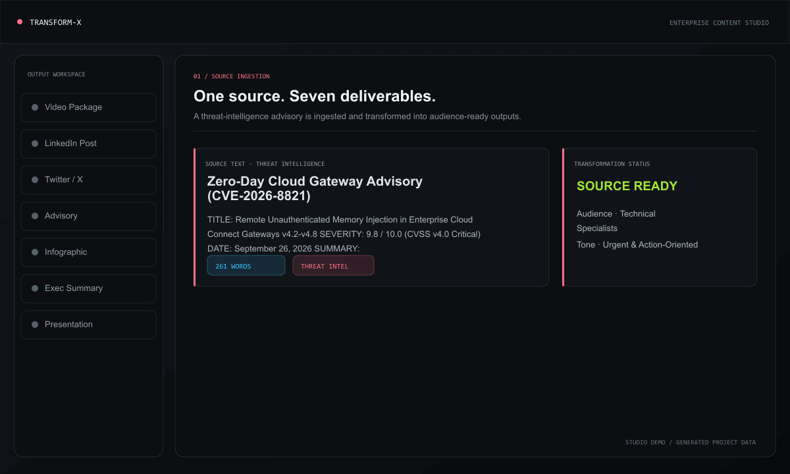
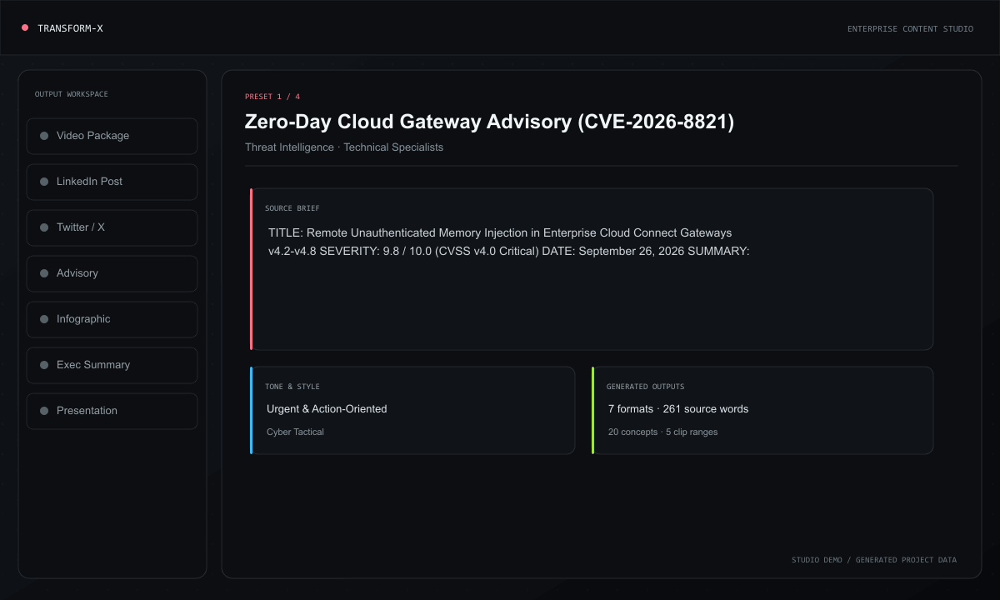
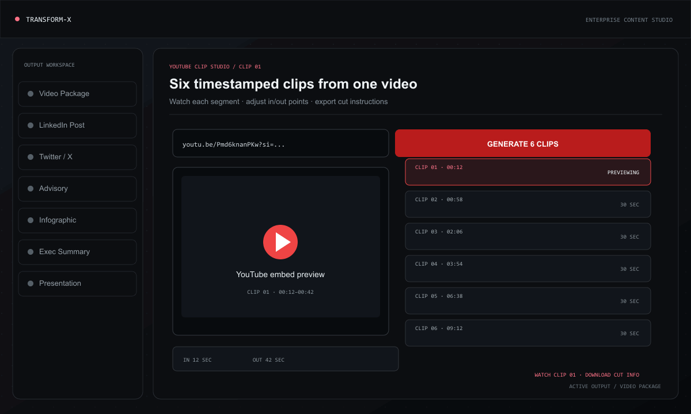
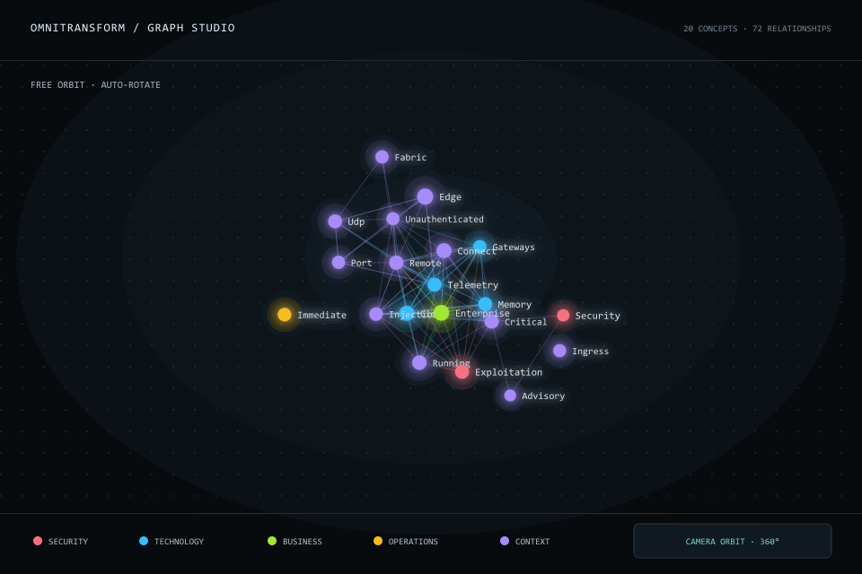
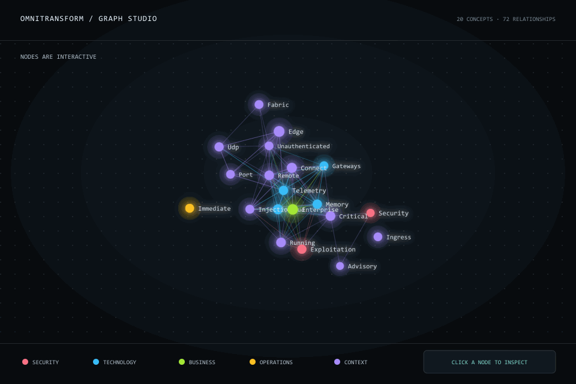
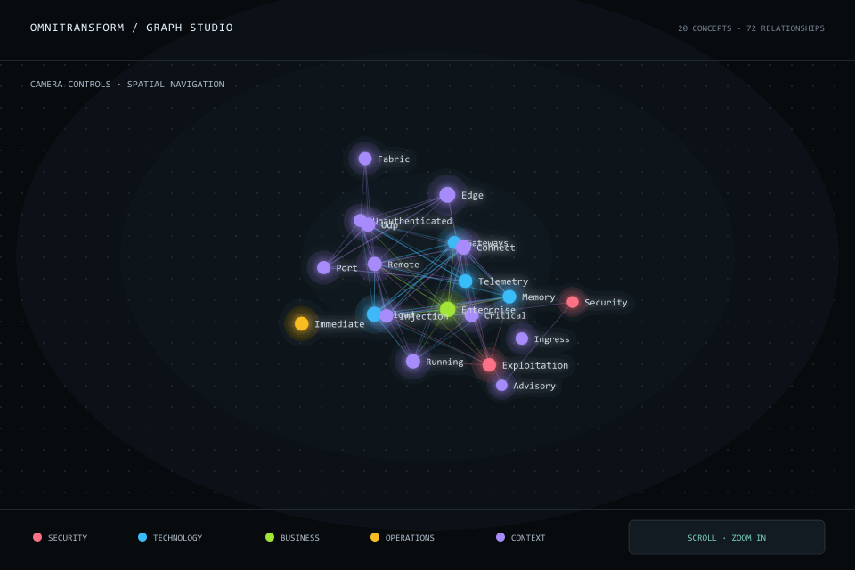

# TRANSFORM-X — Enterprise AI Content Transformation Engine

React + Three.js web studio that turns one source brief into multiple audience-specific communication deliverables: video package, LinkedIn post, Twitter/X thread, advisory, infographic, executive summary, and presentation deck.

> Current app is frontend-only. Generation runs locally in browser through deterministic JavaScript in `src/utils/generatorEngine.js`. No API key, backend, database, or external AI service required.

---

## Demo GIFs

### Project workflow







### 3D concept graph







---

## Features

- Source ingestion studio
  - Paste, type, clear, or upload `.txt`, `.md`, `.json`, `.csv`, `.log` files.
  - Live word, character, and read-time counters.
- Preset library
  - Cyber threat advisory.
  - Quantum/AI research announcement.
  - Financial/ESG earnings brief.
  - Telecom incident response update.
- Operator tuning matrix
  - Target audience.
  - Tone.
  - Language.
  - Detail level.
  - Communication objective.
  - Content style.
  - Concept graph node limit.
  - YouTube clip count.
- Deliverable selector
  - Generate one or all seven formats.
- Export tools
  - Copy complete JSON bundle.
  - Download generated artifacts as `.json`.
- Visual layer
  - Three.js animated studio background.
  - Interactive 3D concept graph using `OrbitControls`.
  - Tailwind CSS responsive UI.
  - Confetti success feedback after generation.

---

## Generated Deliverables

| Format | Output |
| --- | --- |
| Video Package | Storyboard scenes, camera angles, visual cues, narration, AI image/video prompts, SRT subtitles, YouTube clip cut ranges |
| LinkedIn Post | Hook, takeaways, CTA, hashtags, feed-style preview |
| Twitter / X Thread | Numbered thread, character counts, copy-ready tweets |
| Structured Advisory | Severity, impact, affected systems, mitigation checklist |
| Infographic Blueprint | Metric cards, process flow, design prompts, color palette, concept graph |
| Executive Summary | BLUF, strategic pillars, decision points, KPI-style impacts |
| Presentation Deck | Interactive slides, thumbnails, fullscreen mode, speaker notes |

---

## How It Works

1. User enters source content or selects preset.
2. User selects target output formats and tuning parameters.
3. `handleTransform()` in `src/App.jsx` calls `transformContent()`.
4. `transformContent()` analyzes source text:
   - word count
   - line count
   - metrics and numbers
   - domain classification
   - severity
   - color theme
   - cleaned title
   - summary excerpt
5. Generator functions synthesize selected artifact data.
6. `DeliverablesWorkspace` renders tabs for generated formats.
7. Format-specific viewer components display, copy, preview, or export content.

Core pipeline:

```text
Source Text / Preset / File
        ↓
InputPanel + Operator Parameters
        ↓
transformContent()
        ↓
analyzeSourceText()
        ↓
Format generators
        ↓
DeliverablesWorkspace
        ↓
Viewer components + JSON export
```

---

## Architecture

```text
ContentEngine/
├── public/                     # Static favicon/icons
├── scripts/                    # GIF generation scripts
│   ├── create-graph-gifs.js
│   └── create-project-feature-gifs.js
├── src/
│   ├── App.jsx                 # Root state, preset selection, transform orchestration
│   ├── main.jsx                # React entrypoint
│   ├── index.css               # Tailwind import + global styles
│   ├── components/
│   │   ├── Header.jsx          # Top command bar
│   │   ├── InputPanel.jsx      # Source input, formats, tuning controls
│   │   ├── DeliverablesWorkspace.jsx # Output tabs, copy/export actions
│   │   ├── ThreeCanvas.jsx     # Animated WebGL background
│   │   └── viewers/            # Per-format renderers
│   │       ├── VideoViewer.jsx
│   │       ├── LinkedInViewer.jsx
│   │       ├── TwitterViewer.jsx
│   │       ├── AdvisoryViewer.jsx
│   │       ├── InfographicViewer.jsx
│   │       ├── ConceptGraph3D.jsx
│   │       ├── YoutubeClipStudio.jsx
│   │       ├── ExecutiveSummaryViewer.jsx
│   │       └── PresentationViewer.jsx
│   ├── data/
│   │   └── samplePresets.js    # Built-in scenarios
│   └── utils/
│       └── generatorEngine.js  # Analysis + deliverable generation logic
├── video/                      # Demo GIFs used in README
├── package.json
├── vite.config.js
└── README.md
```

---

## Tech Stack

- React 19
- Vite 8
- Tailwind CSS 4
- Three.js
- Lucide React icons
- Canvas Confetti
- Oxlint
- Sharp + gifenc for generated demo GIFs

---

## Requirements

- Node.js 20+ recommended
- npm 10+ recommended

Check local versions:

```bash
node --version
npm --version
```

---

## Installation

Clone or open project folder, then install dependencies:

```bash
npm install
```

---

## Run Development Server

```bash
npm run dev
```

Open:

```text
http://localhost:5173/
```

Run with LAN access:

```bash
npm run dev -- --host 0.0.0.0
```

---

## Production Build

```bash
npm run build
```

Build output lands in:

```text
dist/
```

Preview production build:

```bash
npm run preview
```

Optional fixed port:

```bash
npm run preview -- --port 5173 --host
```

---

## Lint

```bash
npm run lint
```

---

## Generate Demo GIFs

GIFs in `video/` can be regenerated with:

```bash
node scripts/create-project-feature-gifs.js
node scripts/create-graph-gifs.js
```

Outputs:

```text
video/project-deliverables-tour.gif
video/project-presets-and-settings.gif
video/youtube-clips-feature-workflow.gif
video/concept-graph-orbit.gif
video/concept-graph-select-and-drag.gif
video/concept-graph-zoom-and-pan.gif
```

---

## Usage

1. Start app with `npm run dev`.
2. Select preset from header or paste custom source text.
3. Upload file if needed.
4. Select deliverables.
5. Open tuning parameters and adjust audience, tone, style, graph, or clip settings.
6. Click **Transform**.
7. Use tabs in deliverables workspace to review outputs.
8. Copy bundle or export JSON.

---

## Notes

- Generated content is template/simulation output, not live LLM output.
- YouTube Clip Studio creates timestamp cut instructions only. It does not download video media.
- Web Speech API narration depends on browser support.
- Three.js effects may be heavier on low-power devices; use 3D toggle in header if needed.

---

## Available npm Scripts

| Command | Purpose |
| --- | --- |
| `npm run dev` | Start Vite dev server |
| `npm run build` | Build production bundle |
| `npm run preview` | Preview built app locally |
| `npm run lint` | Run Oxlint |
